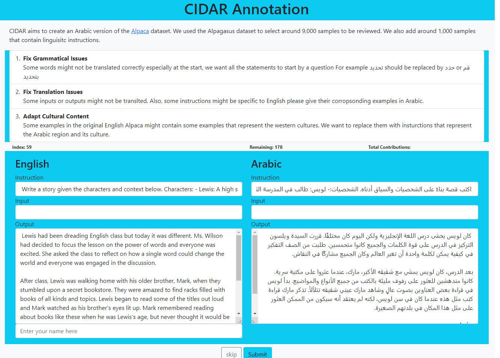

# 🌴CIDAR
<p align="center">

</p>

CIDAR: Culturally-Relevant Instruction Dataset For Arabic. CIDAR contains 10,000 instructions and their outputs. The dataset was created by selecting around 9.2k samples from [Alpagasus](https://huggingface.co/datasets/mlabonne/alpagasus) dataset then translating it using ChatGPT. In addition, we append that with around 800 instructions from the webiste [Ask the teacher](https://learning.aljazeera.net/ar/asktheteacher). All the 10,000 samples are reviewed by around 10 reviewers. 

<p align="center">

</p>

## 📝 CIDAR Annotation

Our data annotation paltform was built on top of flask library. You can follow the next steps to run the app. 

### ⚡️To Run The App:
1. Install the requirements `pip install -r requirements.txt`.
2. Run the app using flask `flask --app app run `.

### ✨ Demo

The annotation app contains two sections: `English` and `Arabic`. Reviewers can make changes on `Instruction`, `Input`, and `Output` to fix mistakes and align data with Arabic culture.

`instruction(str)`: required instruction. Each of the 10K instructions is reviewd by a contributer.

`input(str)`: (Optional) input for the instruction. For example, when the instruction is find the mistake in the next sentence, the input is the sentence.

`output(str)`: response for the instruction given.

 Also, reviewers are able to track their contribution record and how much data are remaining.
<p align="center">

</p>

## 📁 Loading The Dataset
You can download the dataset from [HuggingFace - CIDAR](https://huggingface.co/datasets/arbml/CIDAR). 

```python
from datasets import load_dataset
cidar = load_dataset('arbml/CIDAR')
```

## 📄 Sample From The Dataset:
This sample shows an Arabic-specific intruction which related to `البلاغة` and `الإعراب`. The sentence is orignally in Arabic - not translated from any other lanaguage - 

 `index`: 10030

 `instruction`: لو سمحت اين صيغة المبالغة في " الجاحظ اديب سيارة اراؤه" و ما اعراب الجملة؟

 `output`:
 
           'صيغة المبالغة في هذه الجملة هي "سيّارة"، فاسم الفاعل من "السير" هو '
           '"سائر/ سائرة" وإذا أردت الدلالة على المبالغة في سير الآراء (أي '
           'شهرتها وكثرة تداولها) قلت "آراء سيّارة".\r\n'
           'أما إعراب الجملة فهو: "الجاحظُ": مبتدأ مرفوع بالضمة. "أديبٌ": خبر '
           'مرفوع بالضمة. "سيارةٌ": خبر متقدم، و"آراؤُه": مبتدأ متأخر، وهو '
           'مضاف والهاء ضمير متصل مضاف إليه في محل جر.  ويمكن اعتبار "سيارة" '
           'مبتدأ وهو وصف يعمل عمل فعله، و"آراؤُه" فاعل سدّ مسدّ الخبر.\r\n'
           'وفي الحالتين فجملة "سيارة آراؤه" جملة اسمية في محل رفع نعت '
           'لـ"أديب".'

## 📉 Statistics

...

## ⛔️ Limitations and Future Work

...

## 🧩 Contributers

...

## 🔑 License

...
